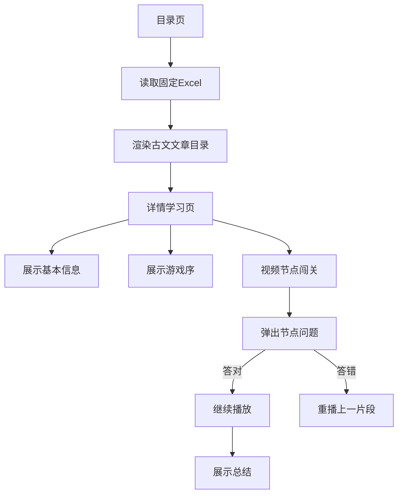

# 纯网页古文学习小游戏计划

## 技术方案

- 使用纯静态前端：`index.html`、`detail.html`、`css/style.css`、`js/*.js`。
- 使用浏览器端 Excel 解析库 SheetJS 读取固定文件，例如 `[data/articles.xlsx](data/articles.xlsx)`。
- 不做后端、不做登录、不做答案隐藏；答案与 Excel 均属于前端资源，调试工具可查看。
- 页面适配 Windows 本地开发和 Gitee Pages 静态发布。

## 数据设计

Excel 模板文件：`[data/articles.xlsx](data/articles.xlsx)`，包含两个工作表，老师只需在表格里填写即可上线。

### 工作表 1：`articles`（文章目录与基础信息）

| 列名 | 说明 | 示例 |
| --- | --- | --- |
| id | 文章唯一编号，目录与问题表通过它关联 | `fatan` |
| 游戏名称 | 目录卡片标题，详情页"展示1"标题 | `古文匠人·魏风伐檀` |
| 适配对象 | 适用学段或专业 | `职业中学 计算机应用专业 高一学生` |
| 核心课文 | 对应古文 | `诗经·伐檀（出自《魏风》）` |
| 时空定位 | 时代与地点 | `春秋时期·魏国（今山西南部黄河沿岸）` |
| 玩法 | 玩法概述 | `线性八关，每关自学任务+1道检验题，答对解锁` |
| 游戏序 | 详情页"展示2"剧情文案 | `你穿越到 2700 年前的黄河之畔……` |
| 视频地址 | 网页可访问的视频 URL（mp4 推荐） | `videos/fatan.mp4` |
| 总结 | 详情页"展示4"总结文案 | `将第八关改为诗歌原本的时空……` |
| 通关奖励 | 完成全部关卡后的奖励文案（可选） | `集齐 8 枚魏风铜章，获得"魏风·伐檀使者"称号` |
| 封面图 | 目录卡片封面图地址（可选） | `images/fatan.jpg` |

### 工作表 2：`questions`（视频节点问题/八关）

| 列名 | 说明 | 示例 |
| --- | --- | --- |
| articleId | 关联 `articles.id` | `fatan` |
| 关卡序号 | 第几关，从 1 开始 | `1` |
| 关卡名称 | 例如"听·辨音识韵" | `听（辨音识韵）` |
| 视频节点秒数 | 视频播放到该秒数时暂停弹题 | `45` |
| 学习目标 | 本关学习目标 | `通过听读，掌握《伐檀》的节奏与入声字` |
| 自学任务 | 本关自学说明 | `听《伐檀》范读…用"/"标记停顿` |
| 题型 | `single` 单选 / `judge` 判断 / `match` 连线 / `sort` 排序 | `single` |
| 题目 | 题干 | `以下哪句朗读停顿正确？` |
| 选项A / 选项B / 选项C / 选项D | 选项内容（不足留空） | `河水/清且涟猗` |
| 正确答案 | 单选填字母；判断填 `对/错`；连线填 `寘=放置;县=悬挂`；排序填 `2,3,1,4` | `A` |
| 答案解析 | 答错时弹窗提示 | `更标准的停顿是…` |
| 重播跳回秒数 | 答错时视频跳回到的秒数（可选，留空则跳到当前节点前 5 秒） | `30` |

字段名直接用中文，老师维护时无需关心英文 key；JS 加载时按列名读取。

`[开发文档1.txt](开发文档1.txt)` 中的《古文匠人·魏风伐檀》内容会作为首条示例数据整理进 Excel 模板。

## 页面流程

## 核心交互

- 目录页：读取 Excel 后展示文章卡片，点击跳转到 `detail.html?id=文章id`。
- 详情页：根据 URL 中的 `id` 读取对应文章数据。
- 展示区：基本信息、游戏序、视频闯关、总结四项内容可做成步骤卡片，前两项支持约 10 秒自动切换。
- 视频闯关：视频播放到 Excel 配置的节点秒数时暂停，弹出题目；答对继续播放，答错跳回上一节点或当前节点前几秒重播。
- 通关反馈：完成全部节点题后展示通关奖励与总结。

## 文件规划

- `[index.html](index.html)`：文章目录页。
- `[detail.html](detail.html)`：文章学习与闯关页。
- `[css/style.css](css/style.css)`：统一页面样式、卡片、弹窗、移动端适配。
- `[js/excel-loader.js](js/excel-loader.js)`：加载并解析 Excel。
- `[js/index.js](js/index.js)`：目录页逻辑。
- `[js/detail.js](js/detail.js)`：详情页、视频节点、题目判定逻辑。
- `[data/articles.xlsx](data/articles.xlsx)`：固定 Excel 数据源（同时作为模板交付，预填《魏风·伐檀》示例数据）。
- `[data/字段说明.md](data/字段说明.md)`：Excel 字段说明文档，老师参考填写。
- `[libs/xlsx.full.min.js](libs/xlsx.full.min.js)`：本地 SheetJS 库文件，避免依赖外网 CDN。

## 验收方式

- 在浏览器打开 `index.html` 能看到文章目录。
- 点击目录项能进入对应文章详情页。
- 详情页能展示：名称、适配对象、核心课文、时空定位、玩法、游戏序、视频地址、视频节点问题、总结。
- 视频到达节点后自动暂停并弹题，答对继续，答错重播。
- 项目可直接上传到 Gitee Pages 作为静态网页访问。
